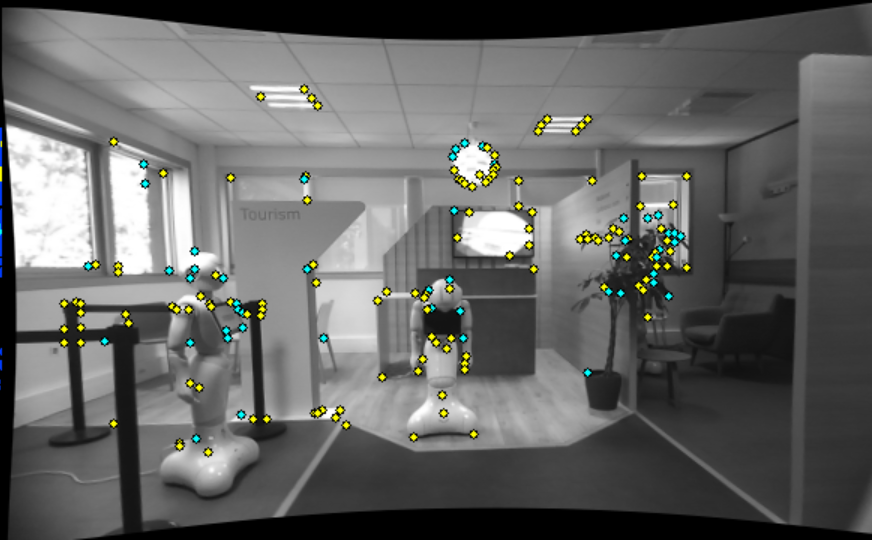
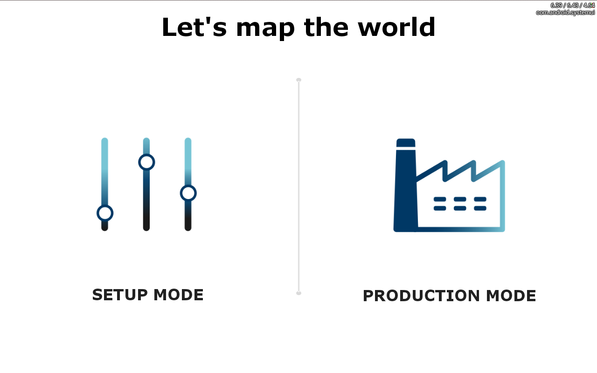
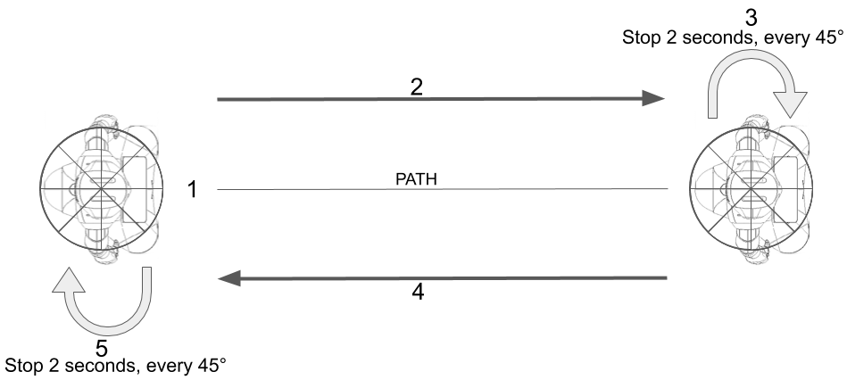
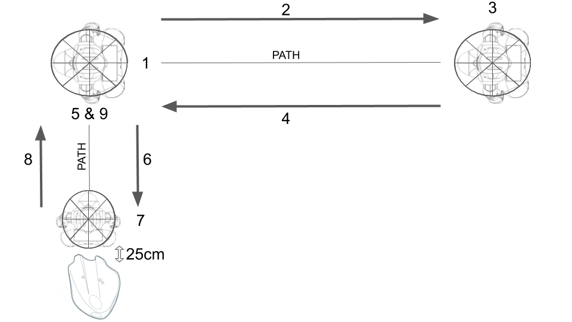
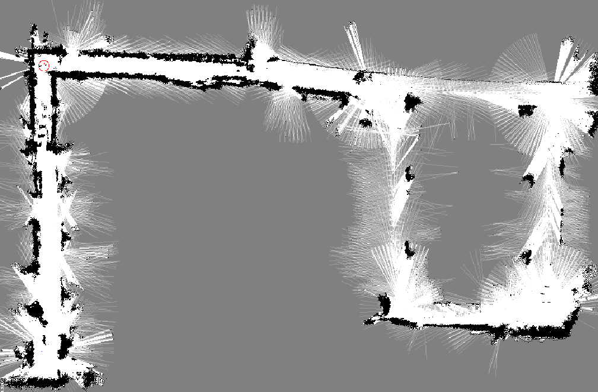
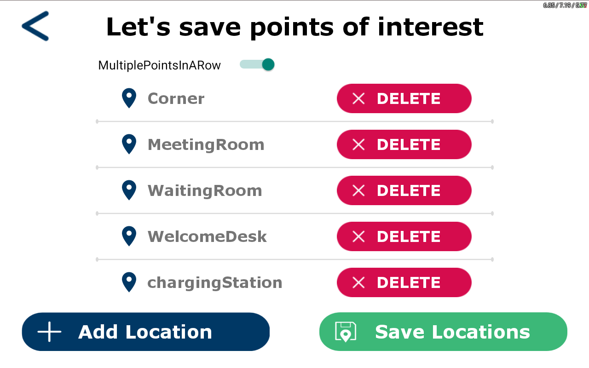
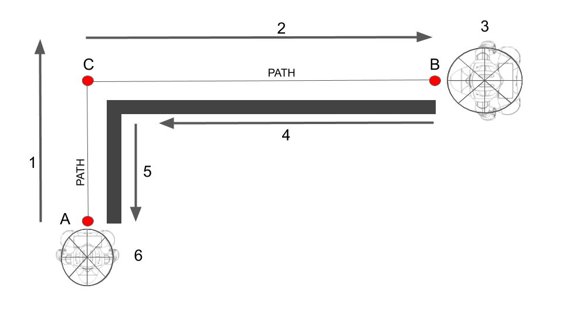
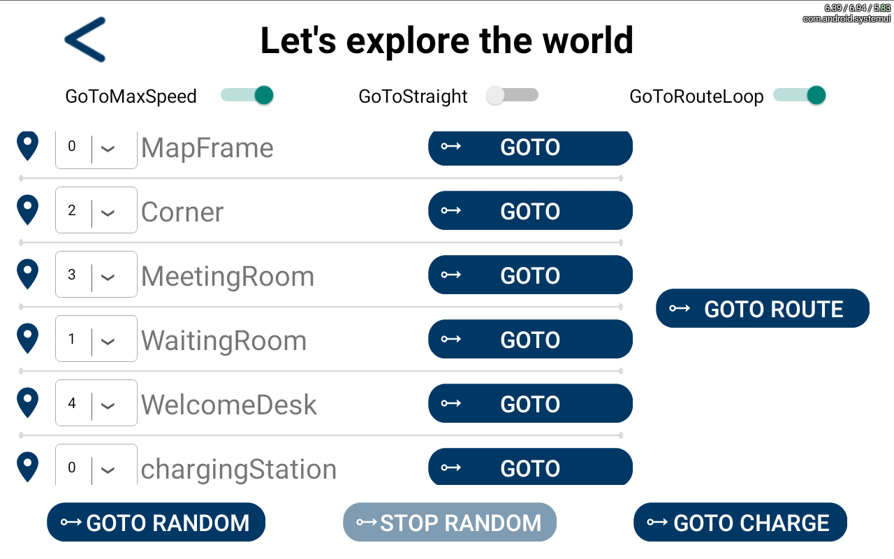

# MapLocalizeAndMove User Guide - Best Practices for Navigation 

This article will present how to use the application **MapLocalize&Move**, and the best practices for Mapping an area.

This version is compatible with Pepper running Naoqi OS 2.9.5.172 and more.

**It is strongly recommended to use a Pepper 1.8 hardware version to perform navigation**.
**This tutorial has been written for Pepper 1.8 hardware version only.**

Required configuration:
* **Software**: NAOqi version 2.9.5.172 (Market Release) 
* **Hardware**: **Pepper 1.8** hardware version (four wholes above the neck). Even if most of the code will work on **Pepper 1.8a**, the performances are not good enough for a **Production Environment**.
* **Charging Station**: If you have a **Charging Station**, it is required to install the application **Autonomous Recharge** on your robot to use it. It is available on [Command Center Store](https://command-center.softbankrobotics.com/store/).

Please make sure that Pepper's volume is not set to zero, as Pepper is giving some instructions by *voice*.

Navigation with Pepper needs to be done in 2 steps:
* **Setup**: when the robot learns its environment in order to get a **Map** and **Points of Interest** (named PoI). 
* **Production**: when the robot navigates using this **Map** and **PoI**. 

Those 2 steps can be done in the same app or in two different apps, but the goal is to have to do the **Setup** once only, and then only run **Production**.

## Setup Mode

### 1) Mapping the environment

**/!\ Mapping should be executed when the place is empty, otherwise, people or others (moving objects) will be recorded in the map as obstacles/anchor points. This will lower the Navigation's performances /!\**

**/!\ Please take care to open Pepper's Charging Flap every time you move Pepper by pushing it /!\**

**Pepper needs to build the map of the room(s) it will have to navigate in. This is done manually, pushing the robot around the room to show it the path it is able to drive through. In order to have good performances when Pepper is navigating, it is mandatory to create a map with very good quality. In order to obtain this quality, please follow very carefully all the steps and advice that are given in this Tutorial.**

During this step, the robot uses its stereo cameras and lasers. The cameras are used to perform visual landmarks detection during which we try to match contrasting corners. Pictures are not saved, only mathematical data associated with it.
You can see on the picture below in yellow the **Anchor Points** that will be saved by Pepper at the end of the mapping.

**The quality of the Map depends also on the environment**

1. Try to maximize the number of different textures in the environment:
* Good:  posters, paintings, plants, furniture, random stuff
* Bad: empty white wall

2. You should try to avoid blur during Mapping. In order to do that:
* For lighting conditions, we recommend 300lux minimum and 500lux or more as nice to have criteria.
* Try to have a moving speed of the robot of 0.3m.s-0.8m.s during Mapping (or less).

3. Avoid reflective grounds.

4. Avoid direct sunlight. It could be considered as an obstacle by the safety lasers.

5. Avoid obstructions of the cameras during Mapping.

6. Pepper needs a minimum of 1.5 meter large path to be able to navigate through. We recommend a minimum of 3 meters.

7. Pepper needs a minimum of 1.5 meter free on both sides of the Charging Station and 2.5 meters in front of it.

**Steps**

#### 1. Launch the MapLocalize&Move application on Pepper and click Setup Mode.

#### 2. Accept the permission popup to allow the application to save information in memory and start Autonomous Recharge Application (if needed).

#### 3. Define "base starting point" named MapFrame

The MapFrame is where you plan to start the app every day. This position will be learned very precisely by Pepper and will represent the origin of your map. The robot will be able to relocalize very precisely at this position, hence getting a good initial position to start navigating in the morning!

**Example**: If Pepper's use case is a guided tour, the MapFrame should be the position of Pepper when it is waiting for a user.
Push Pepper to the chosen position and orientation. The orientation is saved and will be used by Pepper when moving to each point.
Then click Localize & Map and step away. You should not be visible by Pepper.

#### 4. Define the Path of Pepper

Once the mapping of the MapFrame is finished, open the **Charging Flap** and place yourself behind the robot. The safe way to push Pepper is to put one hand on a shoulder and the other one on the hip.

Push Pepper slowly along the desired navigation path (route) that it will have to take during the use of your application. During Mapping, Pepper will take pictures in front of it, it needs to have the same orientation as when it will navigate autonomously on this path later. This means, make the robot move as if it was a car and the tablet is the front of the car.

**When mapping, it is necessary to go along the desired path in both directions to enable the robot to take pictures of its environment in both ways. Then, when it will navigate, it will be able to localize itself in both directions.** (we will see some exceptions later).

If you know some places are key positions where the robot may need to relocalize or interact with People or at the cross of multiple paths, then stop and make a 360° turn, with a pause every 45° by clicking the **Full Turn** button, so the robot can take pictures all around (25 cm in front of the Charging Station for example).

**Example of mapping for multiple kinds of Paths**

If you have a **Charging Station**, leave 25 cm between the front of it and Pepper.

If Pepper is going to perform a part of its path always in the same direction, it is possible to map this part only in one direction. Take a look below.

(The representation of this map is shown below).

When you are done with the mapping in both directions, you should logically be back to where you started, the MapFrame. Try to come back exactly at the starting position (MapFrame) then do a 360° turn, with a pause every 45°  by clicking the **Full Turn** button : it helps to improve the consistency of the map.
Then click on the button named "Save/stop mapping".

Once the **Map** of the environment is saved, you will see a representation of the map on the screen. It is a representation only, because, as said earlier, Pepper uses pictures to localize itself and this representation is not made with the information from the lasers.

The path of this map is 212 meters long.

### 2) Save the desired Points of Interest

In the application interface, the Points of Interest are named **Locations**.
The PoI that you will save during this step enables Pepper to move from one to another. Depending on the shape of your location, it may be necessary to save intermediate points.

Still in Setup Mode, click **Save Locations**, then **Add Locations**. Move Pepper to MapFrame, and then click **You are Home** (don't forget to step away from Pepper). Pepper will localize itself.
Once it's done, Pepper will offer you to save the Position of the Charging Station. If you have one, open the Charging Flap and move Pepper in front of it (where you previously did a 360° turn during **Mapping**), then do a 180° turn (stay behind it) and move Pepper on its Station, then click **Save**. If you don't have a Charging Station, you can press **Skip**.

If not done yet, open the Charging Flap and move Pepper to the PoI/Location that you want Pepper to save. When pushing Pepper, make sure to be on the path you saved during the *Mapping* step, and give Pepper the same orientation it had.
When you reach the point you want to save, give Pepper the desired orientation then click **Save Location**. You can save as many PoI as you want.
When you saved all the needed PoIs, click the **Cross** button then click **Save Locations**.

**Examples of PoIs**
If Pepper's path contains a corner (see image below), Pepper will have difficulties to go from point A to point B. Just add a point C at the corner and make Pepper do a *GOTO* from A to C then C to B. 

**Congratulations! You've just made the tough part :) Now, let's use it!**

## Production Mode

Now that all the data are saved in memory, they will be reloaded automatically the next time you launch the application.

First of all, Pepper needs to know where it is. Move it to the **MapFrame**, then click **Production Mode** then **Localize my Robot**.

If Pepper fails to Localize, make sure that you are exactly on the MapFrame, then click **Retry** 

If Pepper succeeds to Localize, the **GoTo Frame** screen will be displayed (a **Frame** is a **PoI**).

A lot of options are available on this screen, let's go through them.

There are 3 Switches at the top, which are deactivated by default:

#### **GoToMaxSpeed** 

* Deactivated: The default one.
* Activated: Use the maximum speed of Pepper.

#### **GoToStraight** 

* Deactivated: If an obstacle or a person is on the path of Pepper, the robot will try to get around it.
* Activated: If an obstacle or a person is on the path of Pepper, the robot will stop.

#### **GoToRouteLoop** 

* Deactivated: Pepper navigates through the **Route** once.
* Activated: As long as Pepper ends the **Route** with success, it keeps patrolling on it.

The list of the PoIs you saved earlier is displayed on the screen.
To make Pepper navigate to a PoI, just click the associated **GOTO** button. 

#### **GOTO ROUTE**

A **Route** is an ordered list of PoI. Pepper will go to each point, one after the other, following the order of the list. Pepper will only take the **orientation** of the last PoI of the Route.
In order to create a **Route**, use the dropdown button next to each PoI name. The Route will be filled with the PoI that has a number order different from **0**.
Make sure to not use the same number order for 2 PoIs.

#### **GOTO RANDOM**

Pepper will pick a random location in the list of PoIs, then go to it. (The ChargingStation won't be picked).
Despite the success status of the GOTO (finished with Success / Fail / Cancel), 15 seconds after it ends, another PoI will be randomly picked to start the next GOTO.

#### **STOP RANDOM**

Stop the running **GOTO RANDOM** 

#### **GOTO CHARGE**

If you saved the Charging Station PoI, this button will send Pepper in front of it then start the docking process.

#### **Charging Station behavior**

The application Autonomous Recharge is needed to use and integrate the Charging Station into your solution, and it is already on the [Command Center Store](https://command-center.softbankrobotics.com/store/). The User Guide of this application can be found on our [Support pages](https://www.softbankrobotics.com/emea/en/support/pepper-naoqi-2-9/2-daily-use#title-3).

You can start Autonomous Recharge to configure it.

**Minimum and Maximum battery level**
* When the minimum battery level is reached, Autonomous Recharge App will take the focus over the current running application(if any) and will try to make Pepper dock.
* When the maximum battery level is reached, Autonomous Recharge App will take the focus over the current running application(if any) and will try to make Pepper undock.

**Working Schedules**
If activated, you can set the time during which Pepper is to be working. Pepper leaves the Charging Station during the scheduled working time you set, and then goes back to the Charging Station at the end of it.

After the installation of this app, when starting the **MapLocalize&Move** app, you will be asked for the permission to start Autonomous Recharge.

As described [here](https://github.com/aldebaran/qisdk-sample-autonomous-recharge-advanced-integration/blob/master/README.md#features), *Autonomous Recharge* send a signal to *MapLocalize&Move* when the battery level is less than 3% above the specified low battery threshold, or when the time is 5 minutes before the specified docking alarm goes off.

When **MapLocalize&Move** catch this signal, they are 3 possible cases :
* Pepper is waiting (no current GoTo) : Pepper will start a GoTo ChargingStation PoI.
* Pepper is moving due to a **GoTo** (classic or RANDOM) : the current GoTo will be cancelled then a GoTo ChargingStation PoI will be started.
* Pepper is moving due to a **GoTo Route** : The ChargingStation PoI will be added at the end of the current list of PoI to go to. That means that the latest PoI of the list defined by the user needs to be close enough to the ChargingStation PoI to be able to reach it.

When the docking is successful, Autonomous Recharge will release the focus and the application that was previously running will get it back. That means that you need to handle correctly the onResume() and the onRobotFocusGained(QiContext qiContext) when getting back the focus in your own application (if docked / not docked).

In **MapLocalize&Move**, when Pepper undock from the Charging Station, if a **GoToRoute** or a **GoToRandom** was activated when docking, it will try to relocalize, if it succeed, it will restart its task (**GoToRoute** or a **GoToRandom**).

### Conclusion

We hope this article helped you configuring Pepper for navigation! 
Should you have any questions, don't hesitate to reach us by opening a ticket through our [support form](https://account.aldebaran.com/support/).

### License

This project is licensed under the BSD 3-Clause "New" or "Revised" License - see the [COPYING](COPYING.md) file for details.